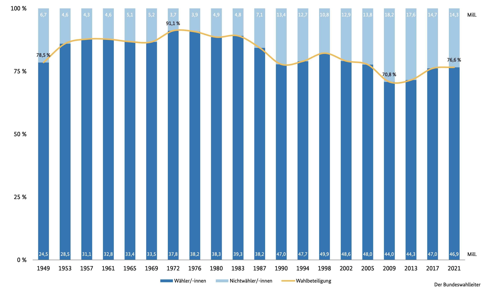

# Definition Nichtwähler

> *Nichtwähler sind Wahlberechtigte, die ihr Wahlrecht nicht in Anspruch nehmen,
> indem sie nicht zur Wahl gehen und auch nicht per Briefwahl wählen.*

# Wahlbeteiligung in Deutschland seit 1949

{ height=256px }

# Probleme des Nichtwählens

- Bei einer einzelnen Wahl haben Nichtwähler keinen Effekt
- Wenn aus einer Partei übermäßig viele Nichtwähler werden, verzerrt das die
  Wahl
- Regierung verliert Legitimität

# Erklärungsansätze

## Normalisierungsthese

- Soziale Konflikte verringern sich mit der Zeit
- Wähler sind mit der Politik zufrieden
  => Es gibt keinen Anreiz, wählen zu gehen

## Modell des rationalen Wählers

- Menschen treffen ihre Entscheidungen rational
- Einfluss der eigenen Stimme sehr gering
  => Kosten/Nutzen zu gering

## Mangel an Bildung

- Politik ist komplex
  => Mangel an Interesse oder willkürliche Wahl
  => Anfällig gegenüber populistischen Parteien

## Soziologischer Erklärungsansatz

- Wahl wird vom sozialen Umfeld bestimmt
- Menschen in einem politikfernen Umfeld beteiligen sich häufiger nicht => Die
  "Nichtwählergemeinschaft" wächst an den Randbereichen

## Krisenthese

- Menschen sind mit der Politik unzufrieden
  => Wähler wollen ihren Parteien einen Denkzettel verpassen

# Lösung Wahlpflicht?

Einsatz in Ägypte, Australien, Liechtenstein, Nordkorea...

## Pro

- Populistische Parteien haben weniger Einfluss
- Bevölkerung wird genauer abgebildet
- Desinteressierte müssen sich mit Politik beschäftigen

## Contra

- Man kann ungültige Stimmzettel abgeben
- Protestwahl möglich
- Eingriff in die persönliche Freiheit
- Unentschlossene Wähler sind anfällig für Propaganda

# Quellen
Alle Quellen, sowie die Präsentation, dieses Handout und die Ausarbeitung sind auf GitHub verfügbar:

https://github.com/DanielMeiborg/GFS-Nichtwaehler

{ width=128px }