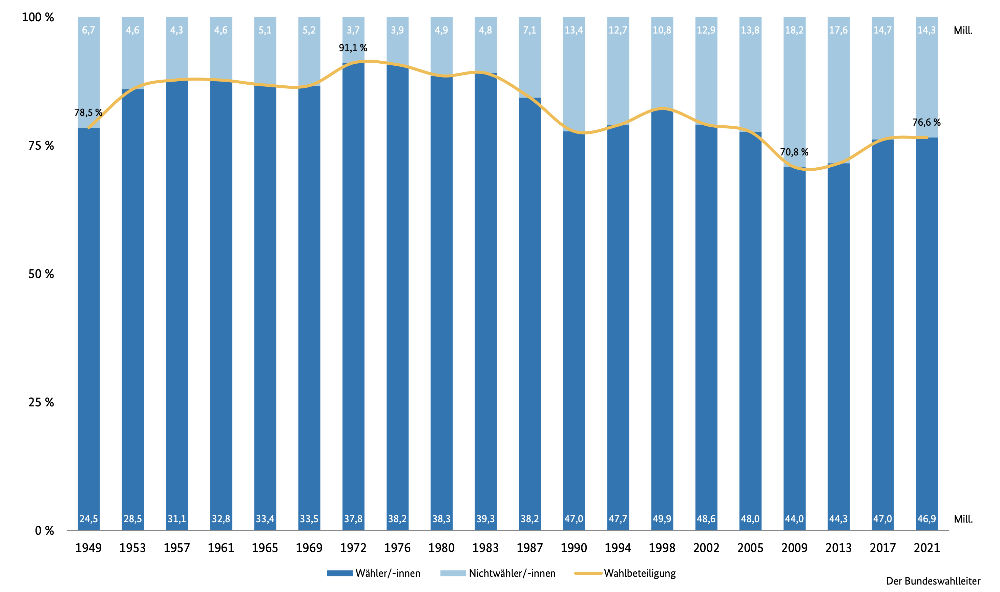

\maketitle
\newpage
\tableofcontents
\newpage

# Einleitung
<!-- TODO: Siehe Buch/206 -->

# Definition Nichtwähler
> *Nichtwähler sind Wahlberechtigte, die ihr Wahlrecht nicht in Anspruch nehmen,
> indem sie nicht zur Wahl gehen und auch nicht per Briefwahl wählen.*
[@bundeswahlleiter2021nichtwaehler]

# Probleme des Nichtwählens
<!-- TODO: Siehe https://de.wikipedia.org/wiki/Nichtwähler#Krisenthese -->
Zunächst einmal scheinen Nichtwähler keinen Effekt auf das Ergebnis einer Wahl
zu haben, schließlich werden sie ja zu keiner Partei gezählt. Nichtsdestotrotz
können Nichtwähler die Ergebnisse einer Wahl massiv beeinflussen.

Die Nichtwählerquote in Deutschland lag 2009 bei 29,2%. Das heißt, alleine durch
Nichtwähler kann eine Partei bis zu 29,2 % der Wählerstimmen verlieren. Das ist
gerade bei einer knappen Wahl - eine enorme Menge.

Umgekehrt kann eine kleine populistische Partei, die weniger als andere Parteien
im Vergleich zu den vorherigen Jahren durch Nichtwähler weniger Stimmen verliert
plötzlich einen deutlich höheren Anteil haben. So könnte eine Partei 2009 schon
mit 36% der Wahlberechtigten eine absolute Mehrheit haben.

# Wahlbeteiligung in Deutschland
Wahlbeteiligung in Deutschland seit 1949 [@bundeswahlleiter2021wahlbeteiligung].
<!-- TODO: Erläuterung des Graphen -->

# Ursachen des Nichtwählens

## Normalisierungsthese
Eine gängige Theorie zur Erklärung der Verringerung der Wahlbeteiligung ist die
Normalisierungsthese. Diese nimmt an, dass sich soziale Konflikte mit der Zeit
verringern und die Wähler so mit der Politik zufrieden sind. Deshalb gibt es
keinen Anreiz, wählen zu gehen [@bohne2010nichtwaehler].

## Modell des rationalen Wählers
Dieses Modell besagt, dass Menschen ihre Entscheidungen rational treffen. Das
heißt, sie treffen Entscheidungen, welche Ihnen die größtmögliche Zufriedenheit
bringen. Die Wahrscheinlichkeit, dass eine Stimme den Ausgang der Wahl
beeinflusst, ist sehr gering. Die Wahlbeteiligung wird also geringer, wenn die
Wähler nicht glauben, dass ihre Wahl etwas bewirken kann.

## Theorie des Demokratiedefizits
Die Theorie des Demokratiedefizits nimmt an, dass die Wähler nicht an der Politik
glauben, weil diese zu komplex ist. Sie denken, dass sie keinen wirklichen
Einfluss auf die Politik haben. Deshalb haben sie nicht den Wunsch, wählen zu
gehen. Diese Theorie beschreibt, warum die Wahlbeteiligung in Ländern mit
hoher Wahlbeteiligung höher ist. In Ländern mit hoher Wahlbeteiligung sind
die Wähler besser informiert und haben so den Eindruck, dass sie etwas
bewirken können.

## Der soziologische Erklärungsansatz
Der soziologische Erklärungsansatz beschreibt die Gesellschaft als ein Netzwerk
von sozialen Beziehungen. Die Beziehungen der Menschen bestimmen, ob sie sich an
der Politik beteiligen. Menschen, die sich nicht an der Politik beteiligen,
haben normalerweise keine Beziehungen zu Menschen, die sich an der Politik
beteiligen. Dies erklärt, warum die Wahlbeteiligung in Ländern mit hoher
Wahlbeteiligung höher ist. In Ländern mit hoher Wahlbeteiligung ist es eher die
Norm, sich an der Politik zu beteiligen [@korte2009wahlen].

## Krisenthese
Die aber wohl häufigste Erklärung ist die sogenannte Krisenthese. Diese besagt,
dass die Menschen sich nicht an der Politik beteiligen, weil sie mit der Politik
unzufrieden sind. Die Enthaltung wird als "Denkzettel" für die Parteien
verwendet, da man sie so nicht wählen möchte, aber eigentlich auch keine der
anderen Parteien. Genauso können sich einige Leute mit keiner der bestehenden
Parteien identifizieren, aber auch keine neue Partei gründen. Die naheliegendste
Lösung ist die Enthaltung.

# Demographische Analyse von Nichtwählern

# Lösung Wahlpflicht?
Eine allgemeine Wahlpflicht besagt, dass alle Bürger eines Landes zur Teilnahme
an einer Wahl verpflichtet sind. Bei einer allgemeinen Wahlpflicht ist es nicht
erforderlich, dass die Wähler bereit sind, an der Wahl teilzunehmen, sondern
lediglich, dass sie die Möglichkeit haben, an der Wahl teilzunehmen. Allgemeine
Wahlen werden in der Regel für nationale oder regionale Wahlen verwendet.

## Einsatz
<!-- TODO: Spezielle Art der Demokratie, siehe Buch
https://de.wikipedia.org/wiki/Demokratieindex-->
Viele Demokratien verzichten auf eine Wahlpflicht. In einigen Ländern steht die
Wahlverweigerung allerdings unter Strafe, sowohl bei Demokratien, als auch bei
totalitären Systemen [@wikipedia2022wahlpflicht]:

- Ägypten
- Australien
- Ecuador
- Fidschi
- Indonesien
- Libanon
- Libyen
- Liechtenstein
- Nauru
- Nordkorea
- ...

## Pro
Der größte Vorteil einer Wahlpflicht in Deutschland wäre die Minderung der
Einflussnahme einer kleinen Meinungsgruppe auf die Demokratie. Da durch geringe
Wahlbeteiligung extremistische Minderheiten einen großen Einfluss erlangen
können, würde eine Wahlpflicht dabei helfen, die Bevölkerung genauer abzubilden.

Außerdem bringt sie politisch Desinterressierte dazu, sich mit ihrer zukünftigen
Regierung zu beschäftigen. Wählen wird auch von vielen als eine demokratische
und moralische Pflicht angesehen.

## Contra
Anderseits können Bürger immer noch einen ungültigen Stimmzettel abgeben. Auch
eine rein zufällige oder Protestwahl ist möglich. Letztlich ist eine Wahlpflicht
auch ein Eingriff in den persöhnlichen Freiheitsbereich. Diese Bürger sind dann
auch anfälliger auf Propaganda, da sie sich normalerweise enthalten würden, nun
aber zum Wählen gezwungen werden und kaum eine eigene Meinug haben.

# Fazit

# Eigenständigkeitserklärung

# Quellen